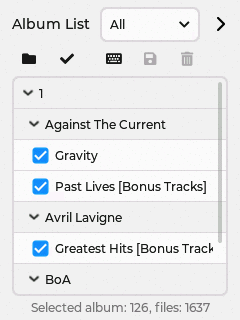

# CYD MP3 Music Player

## 1. Feature

- GUI by [LVGL][1]
- Built-in DAC and amplifier can directly drive a speaker connected to CYD
- Can manage approximately 3,000 music files [^1]
- Can display the cover photo for each album
- "**Playlist**" to display music titles, artist names, and album names
- "**Album List**" to manage the albums you want to play
- Heart-shaped "**Favorites**" button to play only selected files
- Power saving mode to turn off the LCD after a set time, and a sleep timer to shut down the device

## 2. Screens

- **Screen: Main**  
  Controls the playback of audio files included in the playlist.

- **Screen: Playlist**  
  A list of audio file titles, artists, and album names.

- **Screen: Album List**  
  Manages "albums" that contain audio files recorded on a single CD. Albums with a check mark will be included in the playlist.  
  
  In addition to the default list "All", you can create new some lists.

- **Screen: Setting**  
  The number of audio files that can be included in a playlist is limited to approximately 750.   
  
  By creating and switching between several subfolders (called "**Partition**" in this application) on the SD card, you can manage a total of over 3000 files.  
  
  You can also set the time until the backlight turns off and the sleep timer.

## 3. Hardware Requirements

## 4. Software Requirements

### 4.1. Arduino IDE
| Name                       | Version      |
| -------------------------- | ------------ |
| Arduino IDE                | 2.3.4 and up |

### 4.2. Platform board package
| Name                       | Version     |
| -------------------------- | ----------- |
| esp32 by Espressif Systems | 2.0.17 [^2] |

Select [ESP32 Dev Module][2] or [ESP32-2432S028R CYD][3] as a board type to fit your board.

### 4.3. Libraries
| Name                                | Version      | 
| ----------------------------------- | ------------ | 
| [LVGL][4] by kisvegabor             | 9.2.2 and up | 
| [LovyanGFX][5] by lovyan03          | 1.2.7        | 
| [SdFat][6] by Bill Greiman          | 2.3.0        | 
| [ArduinoJson][7] by Benoit Blanchon | 7.4.2        | 

### 4.4. Library configuration

- LVGL  
  After installing LVGL, configure `lv_conf.h` by referring to the official document "[Configure LVGL][8]".  
  
  Some samples of `lv_conf.h` for this application are provided in the [lv_conf directory](lv_conf). For details, see [README.md](lv_conf/README.md).

- SdFat  
  To handle long filenames and multibyte characters, uncomment the definition of the symbol `USE_UTF8_LONG_NAMES` in [libraries/SdFat/src/SdFatConfig.h][9] under your sketchbook folder.

## 5. Application Configuration & Compile/Upload

### 5.1. Editting config.h

Open [`config.h`](config.h) in the Arduino IDE and follow the comments to modify the default settings as desired.

### 5.2. Compile/Upload
Set the following two items from the "Tools" menu in the Arduino IDE.

| Item             | Selection                             | 
| ---------------- |-------------------------------------- |
| Partition Scheme | **"Huge App (3MB No OTA/1MB SPIFFS)"** |
| Upload Speed     |**"460800"**                           |

## 6. How To Use
This application is designed to take albums ripped from CDs and save them directly to your SD card. In addition to `.mp3`, the `.m4a` and `.wav` audio file formats are supported.

### 6.1. About "Partition"
Due to the SRAM capacity of the MCU, if you plan to store a large number of albums, it is recommended that you create subfolders (up to 5) and limit the number of albums to arround 50 titles and the number of audio files to arround 750, in each subfolder.

In this application, such subfolder is named as "Partition" and can be selected in the **"Setting"** screen.

**Note:** If you have more than 750+α (α is around 10), audio files, they will no longer fit in the playlist and management will become a hassle.

### 6.2. Album List

### 6.3. Album Cover Photo

## Have Fun!

----------

[^1]: Estimated number of audio files that can be stored on a 32GB microSD card.

[^2]: In version 3.x, the I2S driver for the internal DAC is deprecated and does not work properly.

[1]: https://lvgl.io/ "LVGL — Light and Versatile Embedded Graphics Library"
[2]: https://github.com/espressif/arduino-esp32/tree/master/variants/esp32 "arduino-esp32/variants/esp32 at master · espressif/arduino-esp32"
[3]: https://github.com/espressif/arduino-esp32/tree/master/variants/jczn_2432s028r "arduino-esp32/variants/jczn_2432s028r at master · espressif/arduino-esp32"
[4]: https://github.com/lvgl/lvgl "lvgl/lvgl: Embedded graphics library to create beautiful UIs for any MCU, MPU and display type."
[5]: https://github.com/lovyan03/LovyanGFX "lovyan03/LovyanGFX: SPI LCD graphics library for ESP32 (ESP-IDF/ArduinoESP32) / ESP8266 (ArduinoESP8266) / SAMD51(Seeed ArduinoSAMD51)"
[6]: https://github.com/greiman/SdFat "greiman/SdFat: Arduino FAT16/FAT32 exFAT Library"
[7]: https://github.com/bblanchon/ArduinoJson "bblanchon/ArduinoJson: 📟 JSON library for Arduino and embedded C++. Simple and efficient."
[8]: https://github.com/greiman/SdFat/blob/master/src/SdFatConfig.h#L34-L35 "SdFat/src/SdFatConfig.h at master · greiman/SdFat"
[9]: https://docs.lvgl.io/master/integration/frameworks/arduino.html#configure-lvgl "Arduino - LVGL 9.5 documentation"
