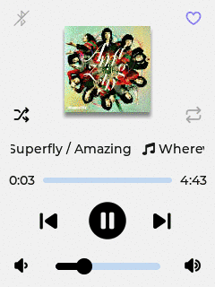
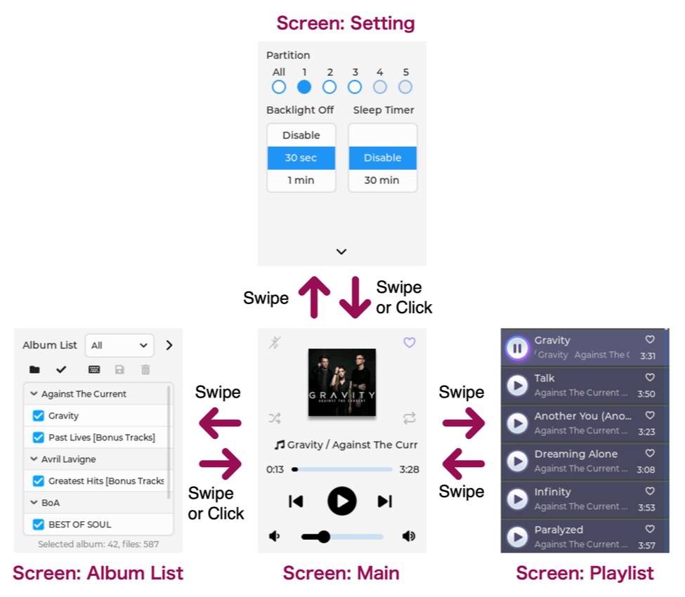

# CYD MP3 Music Player

## Feature

- GUI by [LVGL][1]
- Built-in DAC and amplifier can directly drive a speaker connected to CYD
- Can manage approximately 3,000 music files
- Can display the cover photo for each album
- "**Playlist**" to display music titles, artist names, and album names
- "**Album List**" to manage the albums you want to play
- Heart-shaped "**Favorites**" button to play only selected files
- Power saving mode to turn off the LCD after a set time, and a sleep timer to shut down the device

## Screens

- **Screen: Main**  
  Controls the playback of audio files included in the playlist.

- **Screen: Playlist**  
  A list of audio file titles, artists, and album names.

- **Screen: Album List**  
  Manages "albums" that contain audio files recorded on a single CD. Albums with a check mark will be included in the playlist.  
  
  In addition to the default list "All", you can create new some lists.

- **Screen: Setting**  
  The number of audio files that can be included in a playlist is limited to approximately 750.   
  
  By creating and switching between several subfolders (called "**Partition**" in this application) on the SD card, you can manage a total of over 3000 files.  
  
  You can also set the time until the backlight turns off and the sleep timer.

## Hardware Configuration

## Software Requirements

### Platform board package
| Name                       | Version     |
| -------------------------- | ----------- |
| esp32 by Espressif Systems | 2.0.17 [^1] |

### Libraries
| Name                                | Version      | 
| ----------------------------------- | ------------ | 
| [LVGL][2] by kisvegabor             | 9.2.2 and up | 
| [LovyanGFX][3] by lovyan03          | 1.2.7        | 
| [SdFat][4] by Bill Greiman          | 2.3.0        | 
| [ArduinoJson][5] by Benoit Blanchon | 7.4.2        | 

### Library configuration

- LVGL  
  Refer to the `lv_conf.h` samples for each version and [README.md](lv_conf/README.md) under the `lv_conf` directory in this repository.

- SdFat  
  To handle long filenames and multibyte characters, uncomment the definition of the symbol `USE_UTF8_LONG_NAMES` in [&lt;your sketchbook&gt;/libraries/SdFat/src/SdFatConfig.h][6].

----------

[^1]: In version 3.x, the I2S driver for the internal DAC is deprecated and does not work properly.

[1]: https://lvgl.io/ "LVGL — Light and Versatile Embedded Graphics Library"
[2]: https://github.com/lvgl/lvgl "lvgl/lvgl: Embedded graphics library to create beautiful UIs for any MCU, MPU and display type."
[3]: https://github.com/lovyan03/LovyanGFX "lovyan03/LovyanGFX: SPI LCD graphics library for ESP32 (ESP-IDF/ArduinoESP32) / ESP8266 (ArduinoESP8266) / SAMD51(Seeed ArduinoSAMD51)"
[4]: https://github.com/greiman/SdFat "greiman/SdFat: Arduino FAT16/FAT32 exFAT Library"
[5]: https://github.com/bblanchon/ArduinoJson "bblanchon/ArduinoJson: 📟 JSON library for Arduino and embedded C++. Simple and efficient."
[6]: https://github.com/greiman/SdFat/blob/master/src/SdFatConfig.h#L34-L35 "SdFat/src/SdFatConfig.h at master · greiman/SdFat"

