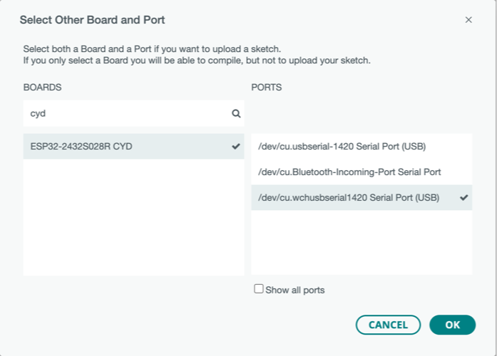

# Board type

In Arduino IDE 2.x, select `ESP32-2432S028R CYD`.



# Auto Detection

By defining `LGFX_AUTODETECT` as shown below, the parameters to be set in [`LGFX_ESP32_sample.hpp`][1] can be automatically set.

```c++
#define LGFX_AUTODETECT
#include <LovyanGFX.h>
```

The board type in this case is `board_Sunton_ESP32_2432S028` defined in [`boards.hpp`][2].
Below is a list of parameters that are set for the two types of CYD.

## Device Settings

| Device Settings   | ILI9341 (micro-USB x 1 type) | ST7789 (micro-USB x 1 + USB-C x 1 type) |
| ----------------- | ---------------------------- | --------------------------------------- |
| Panel type        | **lgfx::Panel_ILI9341**      | **lgfx::Panel_ST7789**                  |
| Bus type          | lgfx::Bus_SPI                | lgfx::Bus_SPI                           |
| Backlight control | lgfx::Light_PWM              | lgfx::Light_PWM                         |
| Touch screen type | lgfx::Touch_XPT2046          | lgfx::Touch_XPT2046                     |

## SPI Bus Settings

| SPI Bus Settings | ILI9341 (micro-USB x 1 type) | ST7789 (micro-USB x 1 + USB-C x 1 type) |
| ---------------- | ---------------------------- | --------------------------------------- |
| spi_host [^1]    | 1 (`HSPI_HOST`)              | 1 (`HSPI_HOST`)                         |
| spi_mode         | 0                            | 0                                       |
| freq_write [^2]  | **40000000**                 | **80000000**                            |
| freq_read        | 16000000                     | 16000000                                |
| spi_3wire        | false                        | false                                   |
| use_lock         | true                         | true                                    |
| dma_channel [^3] | 3 (`SPI_DMA_CH_AUTO`)        | 3 (`SPI_DMA_CH_AUTO`)                   |
| pin_sclk [^4]    | 14 (`CYD_TFT_SCK`)           | 14 (`CYD_TFT_SCK`)                      |
| pin_mosi [^4]    | 13 (`CYD_TFT_MOSI`)          | 13 (`CYD_TFT_MOSI`)                     |
| pin_miso [^4]    | 12 (`CYD_TFT_MISO`)          | 12 (`CYD_TFT_MISO`)                     |
| pin_dc [^4]      | 2 (`CYD_TFT_DC`)             | 2 (`CYD_TFT_DC`)                        |

## Panel Control Settings

| Panel Control    | ILI9341 (micro-USB x 1 type) | ST7789 (micro-USB x 1 + USB-C x 1 type) |
| ---------------- | ---------------------------- | --------------------------------------- |
| pin_cs [^4]      | 15 (`CYD_TFT_CS`)            | 15 (`CYD_TFT_CS`)                       |
| pin_rst [^5]     | -1                           | -1                                      |
| pin_busy         | -1                           | -1                                      |
| panel_width      | 240                          | 240                                     |
| panel_height     | 320                          | 320                                     |
| offset_x         | 0                            | 0                                       |
| offset_y         | 0                            | 0                                       |
| offset_rotation  | **2**                        | **0**                                   |
| dummy_read_pixel | **8**                        | **16**                                  |
| dummy_read_bits  | 1                            | 1                                       |
| readable         | true                         | true                                    |
| invert           | false                        | false                                   |
| rgb_order        | false                        | false                                   |
| dlen_16bit       | false                        | false                                   |
| bus_shared       | false                        | false                                   |
| memory_width     | 240                          | 240                                     |
| memory_height    | 320                          | 320                                     |

## Backlight Control Settings

| Backlight Control | ILI9341 (micro-USB x 1 type) | ST7789 (micro-USB x 1 + USB-C x 1 type) |
| ----------------- | ---------------------------- | --------------------------------------- |
| pin_bl [^4]       | 21 (`CYD_TFT_BL`)            | 21 (`CYD_TFT_BL`)                       |
| invert            | false                        | false                                   |
| freq              | 12000                        | 12000                                   |
| pwm_channel       | 7                            | 7                                       |

## Touch Control Settings

| Touch Control   | ILI9341 (micro-USB x 1 type) | ST7789 (micro-USB x 1 + USB-C x 1 type) |
| --------------- | ---------------------------- | --------------------------------------- |
| x_min           | 300                          | 300                                     |
| x_max           | 3900                         | 3900                                    |
| y_min           | 3700                         | 3700                                    |
| y_max           | 200                          | 200                                     |
| pin_int [^5]    | -1                           | -1                                      |
| bus_shared      | false                        | false                                   |
| offset_rotation | **0**                        | **2**                                   |
| spi_host [^6]   | -1                           | -1                                      |
| freq            | 1000000                      | 1000000                                 |
| pin_sclk [^4]   | 14 (`CYD_TP_CLK`)            | 14 (`CYD_TP_CLK`)                       |
| pin_mosi [^4]   | 13 (`CYD_TP_MOSI`)           | 13 (`CYD_TP_MOSI`)                      |
| pin_miso [^4]   | 12 (`CYD_TP_MISO`)           | 12 (`CYD_TP_MISO`)                      |
| pin_dc [^4]     | 2 (`CYD_TP_CS`)              | 2 (`CYD_TP_CS`)                         |

[^1]: a
[^2]: b
[^3]: c
[^4]: d
[^5]: e
[^6]: f

[1]: https://github.com/lovyan03/LovyanGFX/blob/master/src/lgfx_user/LGFX_ESP32_sample.hpp "LovyanGFX/src/lgfx_user/LGFX_ESP32_sample.hpp at master · lovyan03/LovyanGFX"
[2]: https://github.com/lovyan03/LovyanGFX/blob/master/src/lgfx/boards.hpp#L56C7-L56C34 "LovyanGFX/src/lgfx/boards.hpp at master · lovyan03/LovyanGFX"