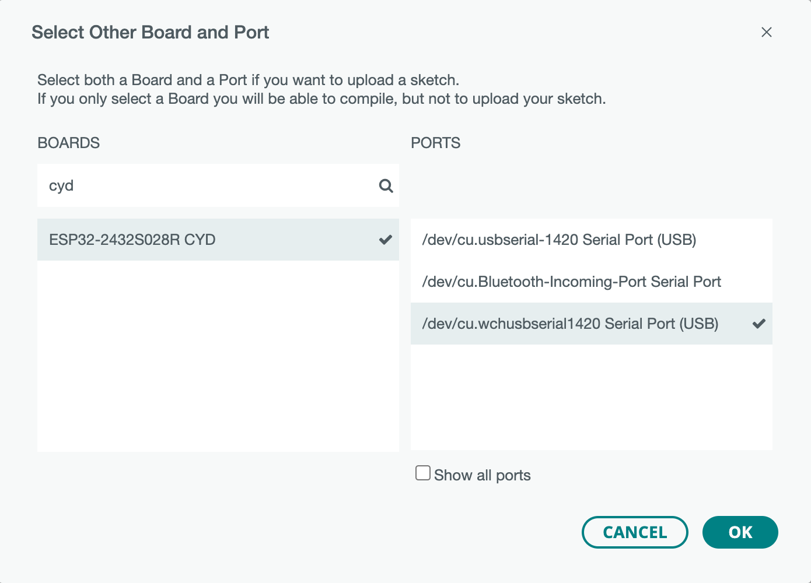

# Board type

In Arduino IDE 2.x, select `ESP32-2432S028R CYD`.



And the ESP32 variant name is `jczn_2432s028r` according to the following definition 
in [`boards.txt`][3], so variant information about partition table or pin assignments 
can be found in [arduino-esp32/variants/jczn_2432s028r/][4].

```txt
jczn_2432s028r.name=ESP32-2432S028R CYD
```

# Auto Detection

By defining `LGFX_AUTODETECT` as shown below, the parameters to be set in 
[`LGFX_ESP32_sample.hpp`][1] can be automatically set.

```c++
#define LGFX_AUTODETECT
#include <LovyanGFX.h>
```

The board type in this case is `board_Sunton_ESP32_2432S028` defined in [`boards.hpp`][2].
Below is a list of parameters that are set for the two types of CYD.

## Device Settings

| Device Settings   | ILI9341 (micro-USB)     | ST7789 (micro-USB + USB-C) |
| ----------------- | ----------------------- | -------------------------- |
| Panel type        | **lgfx::Panel_ILI9341** | **lgfx::Panel_ST7789**     |
| Bus type          | lgfx::Bus_SPI           | lgfx::Bus_SPI              |
| Backlight control | lgfx::Light_PWM         | lgfx::Light_PWM            |
| Touch screen type | lgfx::Touch_XPT2046     | lgfx::Touch_XPT2046        |

## SPI Bus Settings

| SPI Bus Settings | ILI9341 (micro-USB)   | ST7789 (micro-USB + USB-C) | Description |
| ---------------- | --------------------- | -------------------------- | ----------- |
| spi_host [^1]    | 1 (`HSPI_HOST`)       | 1 (`HSPI_HOST`)            | Select the SPI (Due to the ESP-IDF version upgrade, the `VSPI_HOST` and `HSPI_HOST` are deprecated, so if an error occurs, use `SPI2_HOST` and `SPI3_HOST` instead) |
| spi_mode         | 0                     | 0                          | SPI communication mode (0 to 3) |
| freq_write [^2]  | **40000000**          | **80000000**               | SPI clock for transmit (Maximum 80MHz, rounded to an integer value of 80MHz) |
| freq_read        | 16000000              | 16000000                   | SPI clock for receive |
| spi_3wire        | false                 | false                      | Set to true if receive on the MOSI pin |
| use_lock         | true                  | true                       | Set to true if transaction lock is used |
| dma_channel [^3] | 3 (`SPI_DMA_CH_AUTO`) | 3 (`SPI_DMA_CH_AUTO`)      | Set the DMA channel (0:DMA unused, 1:1ch, 2:2ch, `SPI_DMA_CH_AUTO`:auto). Due to the ESP-IDF version upgrade, 1ch or 2ch is no longer recommended. |
| pin_sclk [^4]    | 14 (`CYD_TFT_SCK`)    | 14 (`CYD_TFT_SCK`)         | Set the SPI SCLK pin |
| pin_mosi [^4]    | 13 (`CYD_TFT_MOSI`)   | 13 (`CYD_TFT_MOSI`)        | Set the SPI MOSI pin |
| pin_miso [^4]    | 12 (`CYD_TFT_MISO`)   | 12 (`CYD_TFT_MISO`)        | Set the SPI MISO pin (-1 = disable) |
| pin_dc [^4]      |  2 (`CYD_TFT_DC`)     |  2 (`CYD_TFT_DC`)          | Set the SPI D/C  pin (-1 = disable) |

## Panel Control Settings

| Panel Control    | ILI9341 (micro-USB) | ST7789 (micro-USB + USB-C) | Description |
| ---------------- | ------------------- | -------------------------- | ----------- |
| pin_cs [^4]      | 15 (`CYD_TFT_CS`)   | 15 (`CYD_TFT_CS`)          | CS   pin number (-1 = disable) |
| pin_rst          | -1                  | -1                         | RST  pin number (-1 = disable, TFT_RST is connected to board RST) |
| pin_busy         | -1                  | -1                         | BUSY pin number (-1 = disable) |
| panel_width      | 240                 | 240                        | Panel width |
| panel_height     | 320                 | 320                        | Panel height |
| offset_x         | 0                   | 0                          | Panel offset in X direction |
| offset_y         | 0                   | 0                          | Panel offset in Y direction |
| offset_rotation  | **2**               | **0**                      | Rotation direction offset 0~7 (4~7 are upside down) |
| dummy_read_pixel | **8**               | **16**                     | Number of dummy read bits before pixel read |
| dummy_read_bits  | 1                   | 1                          | Number of dummy read bits before reading non-pixel data |
| readable         | true                | true                       | Set to true if data can be read |
| invert           | false               | false                      | Set to true if the panel is inverted |
| rgb_order        | false               | false                      | Set to true if the red and blue of the panel are swapped |
| dlen_16bit       | false               | false                      | Set to true if the panel transmit data in 16-bit via 16-bit parallel or SPI |
| bus_shared       | false               | false                      | Set to true if the bus is shared with the SD card (The bus is controlled for drawJpg etc.) |
| memory_width     | 240                 | 240                        | Maximum width  supported by driver IC |
| memory_height    | 320                 | 320                        | Maximum height supported by driver IC |

## Backlight Control Settings

| Backlight Control | ILI9341 (micro-USB) | ST7789 (micro-USB + USB-C) | Description |
| ----------------- | ------------------- | -------------------------- | ----------- |
| pin_bl [^4]       | 21 (`CYD_TFT_BL`)   | 21 (`CYD_TFT_BL`)          | Backlight pin number |
| invert            | false               | false                      | Set to true if the backlight brightness is inverted |
| freq              | 12000               | 12000                      | Backlight PWM frequency |
| pwm_channel       | 7                   | 7                          | The PWM channel number |

## Touch Control Settings

| Touch Control   | ILI9341 (micro-USB) | ST7789 (micro-USB + USB-C) | Description |
| --------------- | ------------------- | -------------------------- | ----------- |
| x_min           | 300                 | 300                        | Minimum X value (raw value) from touch screen |
| x_max           | 3900                | 3900                       | Maximum X value (raw value) from touch screen |
| y_min           | 3700                | 3700                       | Minimum Y value (raw value) from touch screen |
| y_max           | 200                 | 200                        | Maximum Y value (raw value) from touch screen |
| pin_int [^5]    | -1                  | -1                         | Interrupt pin number |
| bus_shared      | false               | false                      | Set to true if the bus shared with the screen |
| offset_rotation | **0**               | **2**                      | Adjust when display and touch orientation do not match (0~7) |
| spi_host [^6]   | -1                  | -1                         | Select the SPI (`HSPI_HOST` or `VSPI_HOST`) |
| freq            | 1000000             | 1000000                    | Set the SPI clock |
| pin_sclk [^4]   | 25 (`CYD_TP_CLK`)   | 25 (`CYD_TP_CLK`)          | SCLK pin number |
| pin_mosi [^4]   | 32 (`CYD_TP_MOSI`)  | 32 (`CYD_TP_MOSI`)         | MOSI pin number |
| pin_miso [^4]   | 39 (`CYD_TP_MISO`)  | 39 (`CYD_TP_MISO`)         | MISO pin number |
| pin_dc [^4]     | 33 (`CYD_TP_CS`)    | 33 (`CYD_TP_CS`)           | CS   pin number |

[^1]: Based on the definition in [esp-idf/components/hal/esp32/include/hal/spi_types.h][5] and 
[esp-idf/components/hal/include/hal/spi_types.h][6], `HSPI_HOST` is equivalent to `1`.
[^2]: See [TFT_graphicstest_PDQ - Important note][7].
[^3]: See [ESP-IDF Programming Guide v5.4 documentation][8] and [esp-idf/components/esp_driver_spi/include/driver/spi_common.h][8].
[^4]: See [arduino-esp32/variants/jczn_2432s028r/pins_arduino.h][10].
[^5]: In the [schematic][11] it is connected to the pen output interrupt (`/PENIRQ` = `IO36`) pin. If it's set to `-1` then library polls the signal.
[^6]: TBD.

[1]: https://github.com/lovyan03/LovyanGFX/blob/master/src/lgfx_user/LGFX_ESP32_sample.hpp "LovyanGFX/src/lgfx_user/LGFX_ESP32_sample.hpp at master · lovyan03/LovyanGFX"
[2]: https://github.com/lovyan03/LovyanGFX/blob/master/src/lgfx/boards.hpp#L56C7-L56C34 "LovyanGFX/src/lgfx/boards.hpp at master · lovyan03/LovyanGFX"
[3]: https://github.com/espressif/arduino-esp32/blob/master/boards.txt "arduino-esp32/boards.txt at master · espressif/arduino-esp32"
[4]: https://github.com/espressif/arduino-esp32/tree/master/variants/jczn_2432s028r "arduino-esp32/variants/jczn_2432s028r at master · espressif/arduino-esp32"
[5]: https://github.com/espressif/esp-idf/blob/master/components/hal/esp32/include/hal/spi_types.h "esp-idf/components/hal/esp32/include/hal/spi_types.h at master · espressif/esp-idf"
[6]: https://github.com/espressif/esp-idf/blob/master/components/hal/include/hal/spi_types.h "esp-idf/components/hal/include/hal/spi_types.h at master · espressif/esp-idf"
[7]: https://github.com/embedded-kiddie/Arduino-CYD-2432S028R/tree/main/TFT_graphicstest_PDQ#important-note "Arduino-CYD-2432S028R/TFT_graphicstest_PDQ at main · embedded-kiddie/Arduino-CYD-2432S028R"
[8]: https://docs.espressif.com/projects/esp-idf/en/stable/esp32/api-reference/peripherals/spi_master.html#functions "SPI Master Driver - ESP32 -  &mdash; ESP-IDF Programming Guide v5.4 documentation"
[9]: https://github.com/espressif/esp-idf/blob/master/components/esp_driver_spi/include/driver/spi_common.h#L69-L79 "esp-idf/components/esp_driver_spi/include/driver/spi_common.h at master · espressif/esp-idf"
[10]: https://github.com/espressif/arduino-esp32/blob/master/variants/jczn_2432s028r/pins_arduino.h "arduino-esp32/variants/jczn_2432s028r/pins_arduino.h at master · espressif/arduino-esp32"
[11]: https://github.com/embedded-kiddie/Arduino-CYD-2432S028R/blob/main/Documents/ESP32-2432S028-LCM.jpg
