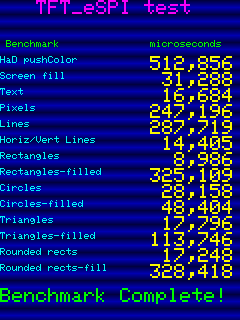
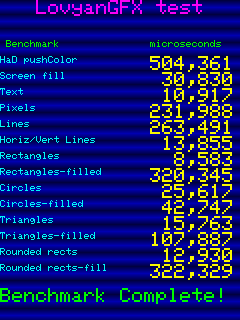
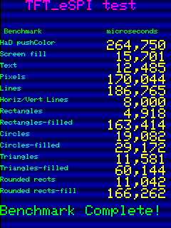
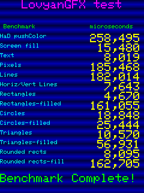

# TFT_graphicstest_PDQ

## Test environments

### Hardware

- ESP32-2432S028 (ESP-WROOM-32)
    - Panel driver: ILI9341 (micro-USB x 1 type)
    - Panel driver: ST7789  (micro-USB x 1 + USB-C x 1 type)

### Software

- Arduino IDE: Version 2.3.4
- ESP32 board package: [v3.1.1][1]
    - Board type: [jczn_2432s028r (name: ESP32-2432S028R CYD)][2]
    - Pin assign: [pins_arduino.h][3]
- Bodmer/TFT_eSPI: [V2.5.43][4]
- lovyan03/LovyanGFX: [1.2.0][5]

## Results

| Benchmark               |TFT_eSPI [^1]|LovyanGFX [^1]|TFT_eSPI [^2]|LovyanGFX [^2]|
| ----------------------- | -----------:| ------------:| -----------:| ------------:|
| HaD pushColor           |      512856 |   **504392** |    265298   |   **258479** |
| Screen fill             |       31288 |    **30831** |     15806   |    **15495** |
| Text                    |       16684 |    **11685** |     11811   |     **7815** |
| Pixels                  |      247196 |   **231964** |  **177755** |     180683   |
| Lines                   |      287719 |   **263504** |    196736   |   **186349** |
| Horiz/Vert Lines        |       14405 |    **13862** |      8058   |     **7633** |
| Rectangles (outline)    |        8986 |     **8584** |      4950   |     **4673** |
| Rectangles (filled)     |      325109 |   **320529** |    164422   |   **161359** |
| Circles (outline)       |       28158 |    **25615** |     19705   |    **18997** |
| Circles (filled)        |       48404 |    **42735** |     29640   |    **25644** |
| Triangles (outline)     |       17796 |    **15770** |     12290   |    **11018** |
| Triangles (filled)      |      113746 |    *107942** |     60899   |    **57143** |
| Rounded rects (outline) |       17248 |    **12927** |     11384   |     **8204** |
| Rounded rects (filled)  |      328418 |   **322343** |    167494   |   **162837** |

-----

[^1]: Panel driver: ILI9341 (micro-USB x 1 type)

  
  

[^2]: Panel driver: ST7789  (micro-USB x 1 + USB-C x 1 type)

  
  

[1]: https://github.com/espressif/arduino-esp32/releases/tag/3.1.1 "Release Arduino Release v3.1.1 based on ESP-IDF v5.3.2 · espressif/arduino-esp32"
[2]: https://github.com/espressif/arduino-esp32/blob/master/boards.txt "arduino-esp32/boards.txt at master · espressif/arduino-esp32"
[3]: https://github.com/espressif/arduino-esp32/tree/master/variants/jczn_2432s028r "arduino-esp32/variants/jczn_2432s028r at master · espressif/arduino-esp32"
[4]: https://github.com/Bodmer/TFT_eSPI/releases/tag/V2.5.43 "Release Bug fixes · Bodmer/TFT_eSPI"
[5]: https://github.com/lovyan03/LovyanGFX/releases/tag/1.2.0 "Release 1.2.0 · lovyan03/LovyanGFX"
