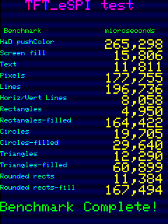
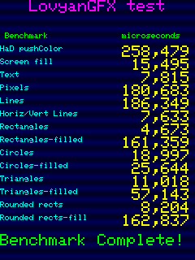

# TFT_graphicstest_PDQ

## Test environments

### Hardware

- ESP32-2432S028 (ESP-WROOM-32) USB x 2 type
    - Panel driver: ST7789

### Software

- Arduino IDE: Version 2.3.4
- ESP32 board package: [v3.1.1][1]
    - Board type: [jczn_2432s028r (name: ESP32-2432S028R CYD)][2]
    - Pin assign: [pins_arduino.h][3]
- Bodmer/TFT_eSPI: [V2.5.43][4]
- lovyan03/LovyanGFX: [1.2.0][5]

## Results

| Benchmark               |   TFT_eSPI |  LovyanGFX |
| ----------------------- | ----------:| ----------:|
| HaD pushColor           |   265298   | **258479** |
| Screen fill             |    15806   |  **15495** |
| Text                    |    11811   |   **7815** |
| Pixels                  | **177755** |   180683   |
| Lines                   |   196736   | **186349** |
| Horiz/Vert Lines        |     8058   |   **7633** |
| Rectangles (outline)    |     4950   |   **4673** |
| Rectangles (filled)     |   164422   | **161359** |
| Circles (outline)       |    19705   |  **18997** |
| Circles (filled)        |    29640   |  **25644** |
| Triangles (outline)     |    12290   |  **11018** |
| Triangles (filled)      |    60899   |  **57143** |
| Rounded rects (outline) |    11384   |   **8204** |
| Rounded rects (filled)  |   167494   | **162837** |

[1]: https://github.com/espressif/arduino-esp32/releases/tag/3.1.1 "Release Arduino Release v3.1.1 based on ESP-IDF v5.3.2 · espressif/arduino-esp32"
[2]: https://github.com/espressif/arduino-esp32/blob/master/boards.txt "arduino-esp32/boards.txt at master · espressif/arduino-esp32"
[3]: https://github.com/espressif/arduino-esp32/tree/master/variants/jczn_2432s028r "arduino-esp32/variants/jczn_2432s028r at master · espressif/arduino-esp32"
[4]: https://github.com/Bodmer/TFT_eSPI/releases/tag/V2.5.43 "Release Bug fixes · Bodmer/TFT_eSPI"
[5]: https://github.com/lovyan03/LovyanGFX/releases/tag/1.2.0 "Release 1.2.0 · lovyan03/LovyanGFX"
