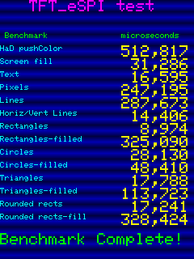

# TFT_graphicstest_PDQ

## Test environments

### Hardware

- ESP32-2432S028 (ESP-WROOM-32)
    - Panel driver: ILI9341 (micro-USB x 1 type)
    - Panel driver: ST7789  (micro-USB x 1 + USB-C x 1 type)

### Software

- Arduino IDE: Version 2.3.4
- ESP32 board package: [v3.1.1][1]
    - Board type: [jczn_2432s028r (name: ESP32-2432S028R CYD)][2]
    - Pin assign: [pins_arduino.h][3]
- Bodmer/TFT_eSPI: [V2.5.43][4]
- lovyan03/LovyanGFX: [1.2.0][5]

## Results

| Benchmark               |TFT_eSPI [^1]|LovyanGFX [^1]|TFT_eSPI [^2]|LovyanGFX [^2]|
| ----------------------- | -----------:| ------------:| -----------:| ------------:|
| HaD pushColor           |      512817 |   **504361** |    264750   |   **258495** |
| Screen fill             |       31286 |    **30830** |     15701   |    **15480** |
| Text                    |       16595 |    **10917** |     12485   |     **8019** |
| Pixels                  |      247195 |   **231988** |  **170044** |     185468   |
| Lines                   |      287673 |   **263491** |    186765   |   **182014** |
| Horiz/Vert Lines        |       14406 |    **13855** |      8000   |     **7643** |
| Rectangles (outline)    |        8974 |     **8583** |      4918   |     **4670** |
| Rectangles (filled)     |      325090 |   **320345** |    163414   |   **161055** |
| Circles (outline)       |       28130 |    **25617** |     19082   |    **18848** |
| Circles (filled)        |       48410 |    **42747** |     29172   |    **25444** |
| Triangles (outline)     |       17788 |    **15763** |     11581   |    **10570** |
| Triangles (filled)      |      113723 |   **107887** |     60144   |    **56931** |
| Rounded rects (outline) |       17241 |    **12930** |     11042   |     **8095** |
| Rounded rects (filled)  |      328424 |   **322329** |    166262   |   **162705** |

### Panel driver: ILI9341 (micro-USB x 1 type)

### Panel driver: ST7789  (micro-USB x 1 + USB-C x 1 type)

## Important note

These tests had been performed with the following SPI bus frequencies:

|                   | Panel driver ILI9341 | Panel driver ST7789 |
| ----------------- |:--------------------:|:-------------------:|
| SPI Bus Frequency | 40 MHz               | 80 MHz              |

In particular, since these tests do not handle sprite images, 
both Panel drivers ILI9341/ST7789 run correctly at 80MHz.

However, the TFT_eSPI [examples/Sprite/Rotated_Sprite_1][6] does not work even 
at 55MHz, and the LovyanGFX [examples/Sprite/RotatedZoomSample][7] results in 
severe image distortion at 80MHz.

[^1]: Panel driver: ILI9341 (micro-USB x 1 type)
[^2]: Panel driver: ST7789  (micro-USB x 1 + USB-C x 1 type)

[1]: https://github.com/espressif/arduino-esp32/releases/tag/3.1.1 "Release Arduino Release v3.1.1 based on ESP-IDF v5.3.2 · espressif/arduino-esp32"
[2]: https://github.com/espressif/arduino-esp32/blob/master/boards.txt "arduino-esp32/boards.txt at master · espressif/arduino-esp32"
[3]: https://github.com/espressif/arduino-esp32/tree/master/variants/jczn_2432s028r "arduino-esp32/variants/jczn_2432s028r at master · espressif/arduino-esp32"
[4]: https://github.com/Bodmer/TFT_eSPI/releases/tag/V2.5.43 "Release Bug fixes · Bodmer/TFT_eSPI"
[5]: https://github.com/lovyan03/LovyanGFX/releases/tag/1.2.0 "Release 1.2.0 · lovyan03/LovyanGFX"
[6]: https://github.com/Bodmer/TFT_eSPI/tree/master/examples/Sprite/Rotated_Sprite_1 "TFT_eSPI/examples/Sprite/Rotated_Sprite_1 at master · Bodmer/TFT_eSPI"
[7]: https://github.com/lovyan03/LovyanGFX/tree/master/examples/Sprite/RotatedZoomSample "LovyanGFX/examples/Sprite/RotatedZoomSample at master · lovyan03/LovyanGFX"
